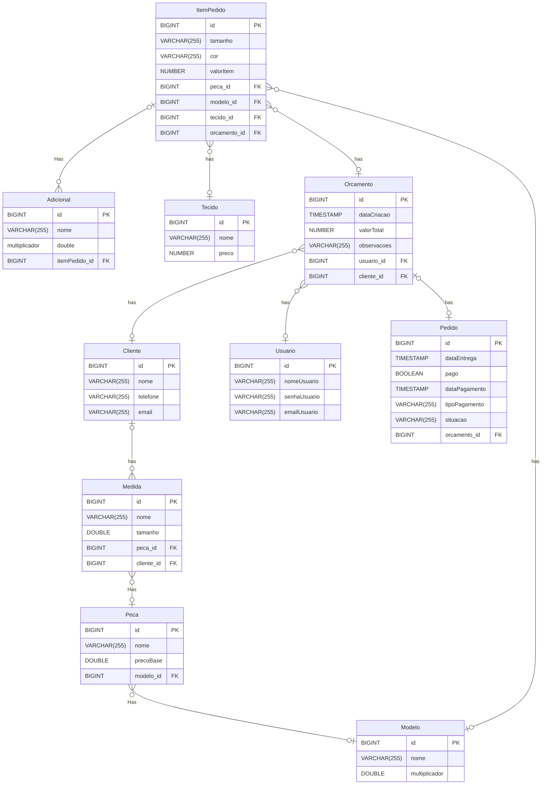
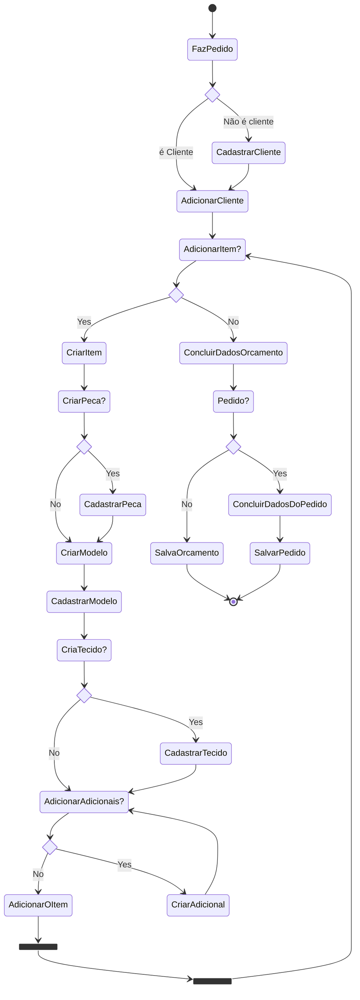

# Table of Contents

1. [CLASS DIAGRAM](#class-diagram)
2. [DATABASE SCHEMA](#database-schema)
3. [TODO](#todo)
   1. [Entidades](#entidades)
   2. [Funcionalidades](#funcionalidades)
   3. [Enuns](#enuns-opcional-ser-enum)
4. [STATE DIAGRAM](#state-diagram)


## CLASS DIAGRAM


## DATABASE SCHEMA

```sql
CREATE TABLE Tecido (
    id BIGINT PRIMARY KEY,
    nome VARCHAR(255),
    preco DECIMAL(18,2)
);


CREATE TABLE Modelo (
    id BIGINT PRIMARY KEY,
    nome VARCHAR(255),
    multiplicador DOUBLE
);

CREATE TABLE Cliente (
    id BIGINT PRIMARY KEY,
    nome VARCHAR(255),
    telefone VARCHAR(255),
    email VARCHAR(255)
);

CREATE TABLE Usuario (
    id BIGINT PRIMARY KEY,
    nomeUsuario VARCHAR(255),
    senhaUsuario VARCHAR(255),
    emailUsuario VARCHAR(255)
);

CREATE TABLE Peca (
    id BIGINT PRIMARY KEY,
    nome VARCHAR(255),
    precoBase DOUBLE,
    modelo_id BIGINT,
    FOREIGN KEY (modelo_id) REFERENCES Modelo(id)
);

CREATE TABLE Medida (
    id BIGINT PRIMARY KEY,
    nome VARCHAR(255),
    tamanho DOUBLE,
    peca_id BIGINT,
    cliente_id BIGINT,
    FOREIGN KEY (peca_id) REFERENCES Peca(id),
    FOREIGN KEY (cliente_id) REFERENCES Cliente(id)
);

CREATE TABLE Orcamento (
    id BIGINT PRIMARY KEY,
    dataCriacao TIMESTAMP,
    valorTotal DECIMAL(18,2),
    observacoes VARCHAR(255),
    usuario_id BIGINT,
    cliente_id BIGINT,
    FOREIGN KEY (usuario_id) REFERENCES Usuario(id),
    FOREIGN KEY (cliente_id) REFERENCES Cliente(id)
);

CREATE TABLE Pedido (
    id BIGINT PRIMARY KEY,
    dataEntrega TIMESTAMP,
    pago BOOLEAN,
    dataPagamento TIMESTAMP,
    tipoPagamento VARCHAR(255),
    situacao VARCHAR(255),
    orcamento_id BIGINT,
    FOREIGN KEY (orcamento_id) REFERENCES Orcamento(id)
);

CREATE TABLE ItemPedido (
    id BIGINT PRIMARY KEY,
    tamanho VARCHAR(255),
    cor VARCHAR(255),
    valorItem DECIMAL(18,2),
    peca_id BIGINT,
    modelo_id BIGINT,
    tecido_id BIGINT,
    orcamento_id BIGINT,
    FOREIGN KEY (peca_id) REFERENCES Peca(id),
    FOREIGN KEY (modelo_id) REFERENCES Modelo(id),
    FOREIGN KEY (tecido_id) REFERENCES Tecido(id),
    FOREIGN KEY (orcamento_id) REFERENCES Orcamento(id)
);

CREATE TABLE Adicional (
    id BIGINT PRIMARY KEY,
    nome VARCHAR(255),
    multiplicador DOUBLE,
    itemPedido_id BIGINT,
    FOREIGN KEY (itemPedido_id) REFERENCES ItemPedido(id)
);

```

## DIAGRAM




## TODO


### Entidades

- Usuario 

    - [ ] A classe Usuario vai armazenar dados do usuário do sistema. 


- Orcamento 

    - [ ] A classe Orcamento vai armazenar as informações de um orçamento de um pedido do ateliê. 

    - [ ] O orçamento tem um usuário e um cliente vinculados e uma lista com todos os itens do pedido. 

    - [ ] O valorTotal é calculado automaticamente baseados no valor de cada item do pedido.

 

- Pedido 

    - [ ] A classe Pedido herda de Orcamento e armazena todas as informações de um pedido do ateliê. 

    - [ ] Os atributos obrigatórios de um pedido além dos atributos do orçamento é a dataEntrega e a situação. 


- ItemPedido 

    - [ ] A classe ItemPedido armazena um item que será utilizado em um orçamento ou em um pedido. 

    - [ ] O valorItem é calculado automaticamente usando o precoBase da peça + preco do tecido + (os multiplicadores dos adicionais * o pecoBase da peça) + (o multiplicador do modelo * o precoBase da peça) + (o multiplicador do tamanho * o precoBase da peça). 


- Tecido 

    - [ ] A classe Tecido armazena o tecido e seu preço por metro. 


- Adicional 

    - [ ] A classe Adicional armazena o adicional e seu multiplicado < 1.


- Modelo 

    - [ ] A classe Modelo armazena um modelo e seu multiplicado < 1. 

    - [ ] Também apresenta a lista de peças que podem utilizar aquele modelo. 


- Peca 

    - [ ] A classe Peca armazena o nome e precoBase de uma peça. 

    - [ ] Também armazena uma lista com medidas específicas para a peça (ex. comprimento da calça) 


- Medida 

    - [ ] A classe Medida armazena uma medida em centímetros. 


- Cliente 

    - [ ] A classe Cliente armazena todas as informações pessoais de um cliente do ateliê. 

    - [ ] Também armazena uma lista de medidas base do cliente (ex. tamanho do busto) 


### Funcionalidades

- [ ] Criar conta para o usuário. 

- [ ] Recuperar senha do usuário. 

- [ ] Excluir usuário (deleta permanentemente banco de dados junto com todos os pedidos e orçamentos vinculados). 

- [ ] Cadastrar cliente (durante o cadastro do usuário é possível adicionar medidas ao cliente) 

- [ ] Editar cliente (também é possível adicionar, editar e remover uma medida do cliente). 

- [ ] Excluir cliente (remove todas as informações pessoais, mas mantém os pedidos e orçamentos como cliente desconhecido). 

- [ ] Adicionar tecido. 

- [ ] Editar tecido (altera preço). 

- [ ] Adicionar adicional. 

- [ ] Editar tecido (altera o multiplicador). 

- [ ] Adicionar modelo. 

- [ ] Editar modelo (altera o multiplicado e pode adicionar ou remover peças da lista)

- [ ] Adicionar peça. 

- [ ] Editar peça (altera o peço base e pode adicionar ou remover medidas da lista) 

- [ ] Criar orçamento (ao adicionar um orçamento é possível criar um cliente e criar itens do pedido para vincular ou orçamento) 

- [ ] Atualizar orçamento. 

- [ ] Excluir orçamento. 

- [ ] Criar pedido (ao adicionar um orçamento é possível criar um cliente e criar itens do pedido para vincular ou orçamento) 

- [ ] Atualizar pedido (não é possível com pedidos "concluído") 

- [ ] Criar item do pedido (só é possível criar durante a criação de orçamento ou de pedido, é possível adicionar um peça, modelo, adicional ou tecido durante a criação do item) 

- [ ] Listar pedidos (criar filtros) 

- [ ] Listar orçamentos. 

- [ ] Listar clientes. 

- [ ] Listar tecidos.

- [ ] Listar adicionais. 

- [ ] Listar peças. 

- [ ] Listar modelos. 

- [ ] Relatório do pedido (gerar um arquivo com os dados do pedido


### Enuns opcional ser Enum

- tipoPagamento (Pedido) 

    - [ ] débito 

    - [ ] crédito 

    - [ ] dinheiro 

    - [ ] pix 


- situacao (Pedido) 

    - [ ] criado 

    - [ ] em produção 

    - [ ] pago 

    - [ ] entregue 

    - [ ] em ajuste 

    - [ ] finalizado 


- tamanho(ItemPedido) 

    - [ ] pp (multiplicador = 0,00) 

    - [ ] p (multiplicador = 0,02) 

    - [ ] m (multiplicador = 0,04) 

    - [ ] g (multiplicador = 0,06) 

    - [ ] gg (multiplicador = 0,08) 

    - [ ] exgg (multiplicador = 0,1) 


- cor (ItemPedido) 

    - [ ] Azul 

    - [ ] Amarelo 

    - [ ] Verde 

    - [ ] Vermelho 

    - [ ] Preto 

    - [ ] Roxo 

    - [ ] Laranja 

    - [ ] Branco 

    - [ ] Marron


## STATE DIAGRAM




<a href="#top" class="go-top-button">Go to Top</a>


