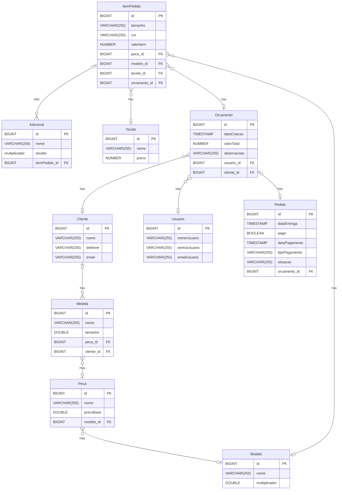

```sql

CREATE TABLE Tecido (
    id BIGINT PRIMARY KEY,
    nome VARCHAR(255),
    preco DECIMAL(18,2)
);


CREATE TABLE Modelo (
    id BIGINT PRIMARY KEY,
    nome VARCHAR(255),
    multiplicador DOUBLE
);

CREATE TABLE Cliente (
    id BIGINT PRIMARY KEY,
    nome VARCHAR(255),
    telefone VARCHAR(255),
    email VARCHAR(255)
);

CREATE TABLE Usuario (
    id BIGINT PRIMARY KEY,
    nomeUsuario VARCHAR(255),
    senhaUsuario VARCHAR(255),
    emailUsuario VARCHAR(255)
);

CREATE TABLE Peca (
    id BIGINT PRIMARY KEY,
    nome VARCHAR(255),
    precoBase DOUBLE,
    modelo_id BIGINT,
    FOREIGN KEY (modelo_id) REFERENCES Modelo(id)
);

CREATE TABLE Medida (
    id BIGINT PRIMARY KEY,
    nome VARCHAR(255),
    tamanho DOUBLE,
    peca_id BIGINT,
    cliente_id BIGINT,
    FOREIGN KEY (peca_id) REFERENCES Peca(id),
    FOREIGN KEY (cliente_id) REFERENCES Cliente(id)
);

CREATE TABLE Orcamento (
    id BIGINT PRIMARY KEY,
    dataCriacao TIMESTAMP,
    valorTotal DECIMAL(18,2),
    observacoes VARCHAR(255),
    usuario_id BIGINT,
    cliente_id BIGINT,
    FOREIGN KEY (usuario_id) REFERENCES Usuario(id),
    FOREIGN KEY (cliente_id) REFERENCES Cliente(id)
);

CREATE TABLE Pedido (
    id BIGINT PRIMARY KEY,
    dataEntrega TIMESTAMP,
    pago BOOLEAN,
    dataPagamento TIMESTAMP,
    tipoPagamento VARCHAR(255),
    situacao VARCHAR(255),
    orcamento_id BIGINT,
    FOREIGN KEY (orcamento_id) REFERENCES Orcamento(id)
);

CREATE TABLE ItemPedido (
    id BIGINT PRIMARY KEY,
    tamanho VARCHAR(255),
    cor VARCHAR(255),
    valorItem DECIMAL(18,2),
    peca_id BIGINT,
    modelo_id BIGINT,
    tecido_id BIGINT,
    orcamento_id BIGINT,
    FOREIGN KEY (peca_id) REFERENCES Peca(id),
    FOREIGN KEY (modelo_id) REFERENCES Modelo(id),
    FOREIGN KEY (tecido_id) REFERENCES Tecido(id),
    FOREIGN KEY (orcamento_id) REFERENCES Orcamento(id)
);

CREATE TABLE Adicional (
    id BIGINT PRIMARY KEY,
    nome VARCHAR(255),
    multiplicador DOUBLE,
    itemPedido_id BIGINT,
    FOREIGN KEY (itemPedido_id) REFERENCES ItemPedido(id)
);

```

